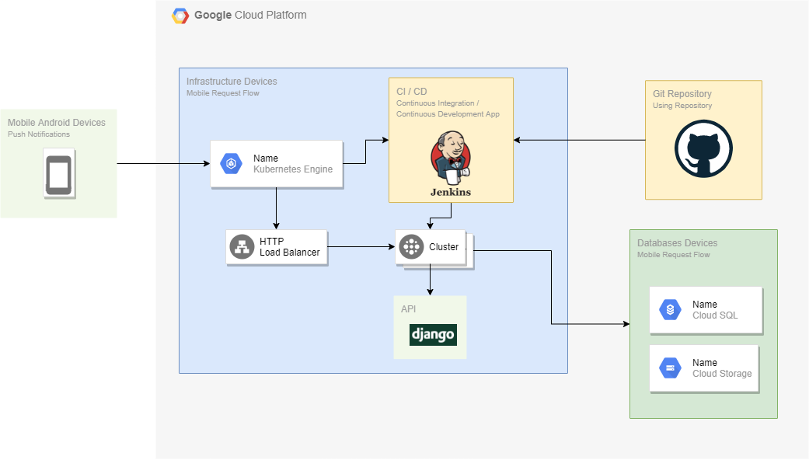
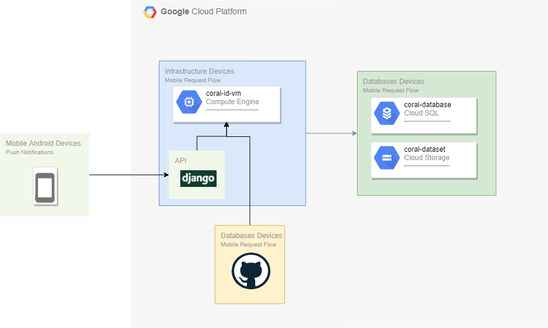

# Project Cloud using GCP (Google Cloud Platform)

***

## Description

For the first infrastructure design, we used Kubernetes Engine mainly for serving our Django REST API and machine learning model. The reason why we used Kubernetes Engine because we can deploy our code using CI/CD concept by implementing Jenkins and Docker on the process. To configure the Jenkins, we setups a jenkins file based on our reference and modify it, the jenkins file also automatically insert the secret manager value into the settings.py and also build an docker image using container registry. The jenkins file also will deploy it on the kubernetes engine. The design also used Cloud SQL as database for the corals information and also Cloud Storage for saving the images and machine learning model. The infrastructure design will looks like this: 

When working on this infrastructure design, we successfully implemented CI/CD concept into the cloud infrastructure. The problem that we faced when working on this infrastructure is the django code didn’t response as we intended when integrating with machine learning model and also we low on our budgets. 

The second infrastructure design and the design we ended up with, where the main component is using Compute Engine for serving our Django REST API. We used E2 series with machine type e2 medium and operating system Debian. The environment we setup in the Compute Engine was:

- Setting up new user account for running django environment
- Pull the bangkit team repository from Github
- Installing requirements.txt using pip3
- Settings Environment Variables based on our team needs
- Run django services on port 80

The django code we setup to automatically pull machine learning model from github, so we do not need to upload manually into the machine. The design for the infrastructure will looks like this:

## References

- https://www.youtube.com/watch?v=Y_rh-VeC_j4 (dockerizing Django API)
- [https://chriskyfung.github.io/blog/qwiklabs/deploy-to-kubernetes-in-google-cloud-challenge-lab](https://chriskyfung.github.io/blog/qwiklabs/deploy-to-kubernetes-in-google-cloud-challenge-lab)
- [https://chriskyfung.github.io/blog/qwiklabs/Implement-DevOps-in-Google-Cloud-Challenge-Lab](https://chriskyfung.github.io/blog/qwiklabs/Implement-DevOps-in-Google-Cloud-Challenge-Lab)
- [https://medium.com/avmconsulting-blog/kubernetes-ci-cd-using-jenkins-on-google-cloud-5b10da6147a6](https://medium.com/avmconsulting-blog/kubernetes-ci-cd-using-jenkins-on-google-cloud-5b10da6147a6)
- [https://github.com/GoogleCloudPlatform/continuous-deployment-on-kubernetes](https://github.com/GoogleCloudPlatform/continuous-deployment-on-kubernetes)
- [https://cloud.google.com/kubernetes-engine/docs/tutorials/hello-app](https://cloud.google.com/kubernetes-engine/docs/tutorials/hello-app)
- [https://cloud.google.com/architecture/continuous-delivery-jenkins-kubernetes-engine](https://cloud.google.com/architecture/continuous-delivery-jenkins-kubernetes-engine)
- [https://stackoverflow.com/questions/43469281/how-to-predict-input-image-using-trained-model-in-keras](https://stackoverflow.com/questions/43469281/how-to-predict-input-image-using-trained-model-in-keras)